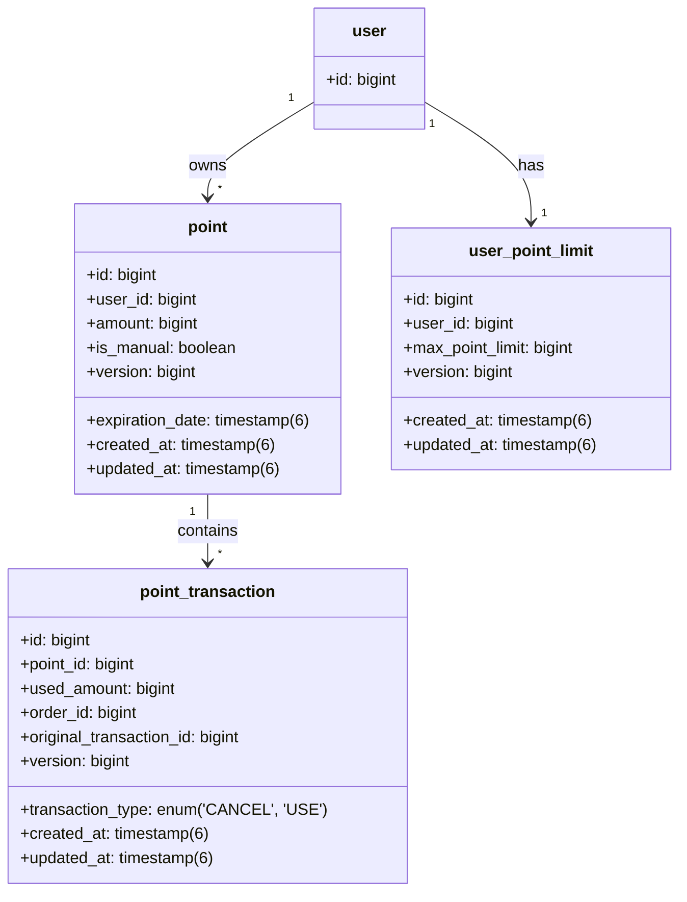

# 무신사페이먼츠 - 무료 포인트 시스템 API

## 개요
이 프로젝트는 무신사페이먼츠의 무료 포인트 시스템 API입니다. 사용자가 포인트를 적립하고, 사용할 수 있으며, 사용 취소 및 만료 관리 기능을 제공합니다. 본 애플리케이션은 **Java 21**과 **Spring Boot 3.x**, **H2 데이터베이스**를 기반으로 개발되었습니다.

## 주요 기능
- **포인트 적립**: 사용자가 포인트를 적립하고 만료 기한을 설정 가능
- **포인트 취소**: 적립한 포인트를 취소할 수 있음
- **포인트 사용**: 주문 시 포인트를 사용할 수 있으며, 관리자 지급 포인트와 만료 기간이 짧은 포인트를 우선 사용
- **포인트 사용 취소**: 환불 시 만료된 포인트는 재적립 처리
- **포인트 추적**: 포인트 적립 및 사용 내역을 상세히 기록

## 기술 스택
- **언어**: Java 21
- **프레임워크**: Spring Boot 3.x
- **데이터베이스**: H2 (인메모리, 개발용)
- **빌드 도구**: Gradle
- **API 문서화**: OpenAPI (Swagger)
- **쿼리 관리**: QueryDSL

## 설치 및 실행 방법
### 로컬 실행 방법

```sh
# 애플리케이션 빌드
./gradlew clean build

# 애플리케이션 실행
./gradlew bootRun
```

API 기본 경로:
```
http://localhost:8080/points
```

### H2 데이터베이스 콘솔 접속
```
http://localhost:8080/points/h2-console
```
로그인 정보:
- **JDBC URL**: `jdbc:h2:mem:testdb`
- **아이디**: `sa`
- **비밀번호**: `test`

## API 문서
OpenAPI(Swagger)를 통해 API 명세서를 확인할 수 있습니다:
```
http://localhost:8080/points/swagger-ui/index.html
```

### API 엔드포인트
| 메서드 | 엔드포인트      | 설명 |
|--------|---------------|-------------|
| POST   | `/`           | 포인트 적립 |
| DELETE | `/{id}`       | 포인트 취소 |
| POST   | `/use`        | 포인트 사용 |
| POST   | `/use/cancel` | 포인트 사용 취소 |

### 요청 예시
#### 포인트 적립
```json
POST /points/
{
  "userId": 1,
  "amount": 5000,
  "isManual": false,
  "expirationDays": 365
}
```

#### 포인트 사용
```json
POST /points/use
{
  "userId": 1,
  "orderId": 1001,
  "useAmount": 5000
}
```

#### 포인트 사용 취소
```json
POST /points/use/cancel
{
  "orderId": 1001,
  "cancelAmount": 5000
}
```


## ERD (Entity Relationship Diagram)
다음은 데이터베이스 설계를 나타내는 ERD입니다:




## 빌드 및 의존성 관리
이 프로젝트는 Gradle을 사용하여 빌드됩니다. 주요 의존성은 다음과 같습니다:
```gradle
plugins {
    id 'java'
    id 'org.springframework.boot' version '3.3.5'
    id 'io.spring.dependency-management' version '1.1.6'
}

dependencies {
    implementation 'org.springframework.boot:spring-boot-starter-data-jpa'
    implementation 'org.springframework.boot:spring-boot-starter-web'
    implementation 'org.springframework.boot:spring-boot-starter-validation'
    implementation 'org.springdoc:springdoc-openapi-starter-webmvc-ui:2.0.4'
    implementation 'com.querydsl:querydsl-jpa'
    runtimeOnly 'com.h2database:h2'
    testImplementation 'org.springframework.boot:spring-boot-starter-test'
}
```

## 설정 파일 (application.yml)
```yaml
spring:
  datasource:
    url: jdbc:h2:mem:testdb
    driver-class-name: org.h2.Driver
    username: sa
    password: test
  jpa:
    hibernate:
      ddl-auto: update
    show-sql: true
  h2:
    console:
      enabled: true
      path: /h2-console

server:
  servlet:
    context-path: /points

point:
  min-earn-amount: 1
  max-earn-amount: 100000
  default-expiration-days: 365
```


---


